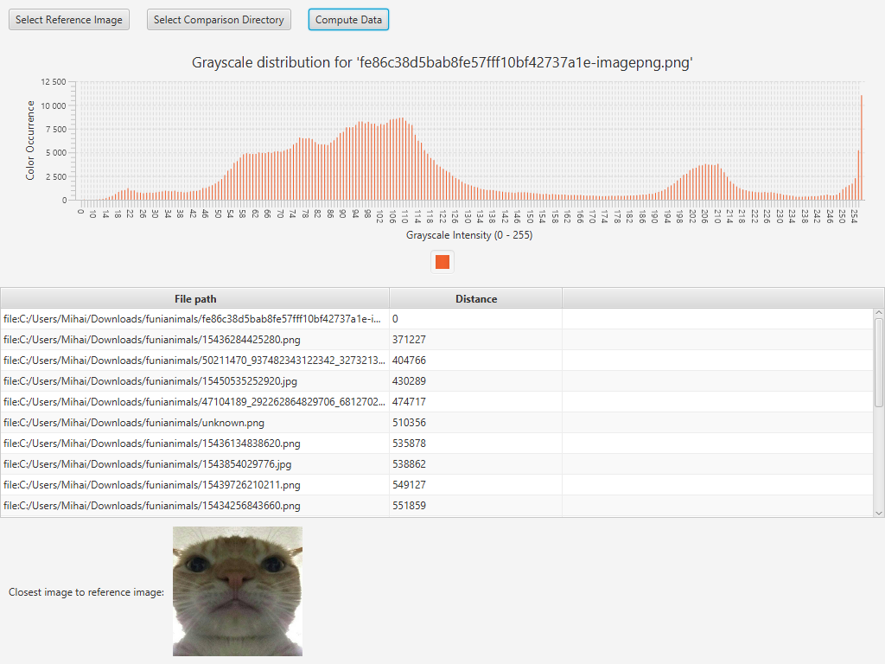

# Image Matcher

## Description

The mechanism of this project is simple.

It gives you the closest image to your reference image by calculating an **absolute grayscale distance** to the reference.

The difference from a **normalized grayscale distance** it that pixel count  cannot influence the final comparison while the absolute distance can give you significantly different results from what you expect. *(the normalized image computation is to be implemented later in the project)*

Before calculating the grayscale distance, the images are transformed into a dictionary of 256 sets, with the key being the grayscale opacity and the value of the set being the number of occurrences of that grayscale value. 

### Grayscale distance formula

## Preview

